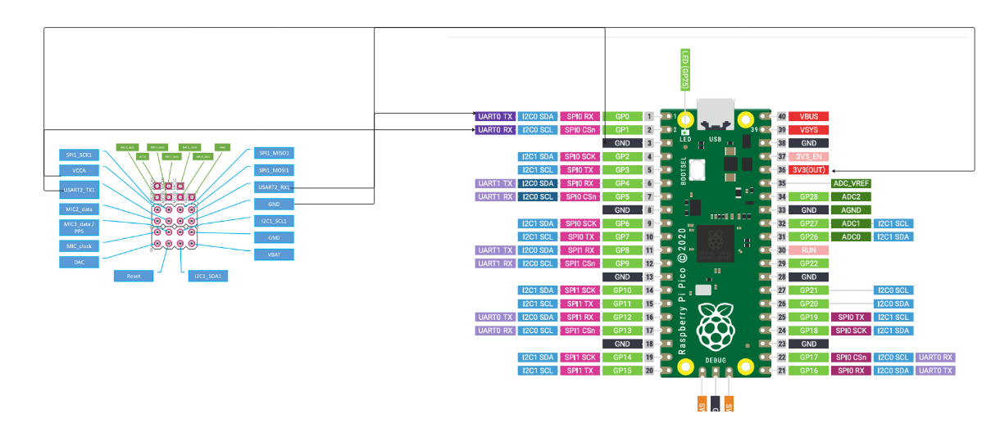

# IoTProject

Indoor tracking with Industrial Ultrasonic sensor. The tracker device (mounted on moving device) is connected to PICO WH controller. 


On pico umqtt is installed to publish data over io.adafruit mqtt broker. And UART library is used to communicate with sensor over 500000 baud rate. For this operation PublishMQTTData.py is used. 

On system, to subscribe to location data SubscribeData.py is used. It has functions to subscribe to adafruit broker, and write the same info to SQLite database. 

The information recieved is byte string, for instance b'\xffG\x81\x00\x1a\xd5\x14\x7f`\x98\x01\x00\x00y\x0b\x00\x00\x00\x00\x00\x00\x00\x00\x00\x00\x02.\x00\x00\x85\x00\x0fC\xffG\x84\x00$.\x1bI\x0c\x00\x00\x00.\x00\x00\x00\x00\x00\x00\x00\x00\x00\x00\x00\x00\x00\x00\x00\x00\x00\xd5\x14\x7f`\x98\x01\x00\x00\x85\x00\x00\xd4c\xff'

Thie information is parsed through marvelmind.py file, marvel mind library decode various information such as position, distnce, rawIMU. Out of all this information, only position data is being saved in database. 

```
if hedge.positionUpdated:
    write_data_sqlite(hedge.position())
    return hedge.print_position()
```
